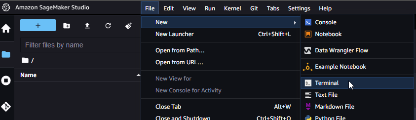
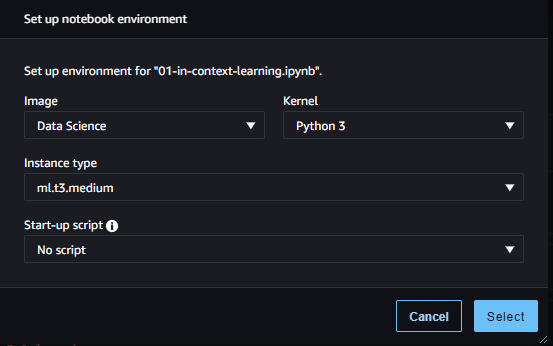
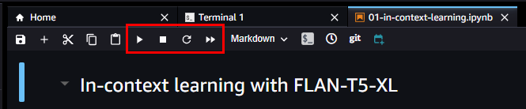
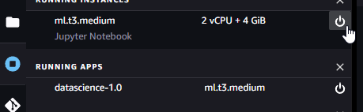

# Setup
How to setup the project in AWS Sagemaker

If you want to setup the sagemaker envrionment locally, please see: https://towardsdatascience.com/setting-up-amazon-sagemaker-environment-on-your-local-machine-7329e0178adc

1. Connect to the AWS Sagemaker console: https://console.aws.amazon.com/sagemaker
2. Choose the region where you want to setup sagemaker environment
3. On the left pane, click on "Studio"
4. Create a new sagemaker domain or open an existing one
5. In SageMaker Studio, open a new terminal in File > New > Terminal

    

6. Type `git clone https://github.com/X-Immersion/sagemaker-jumpstart-generative-ai-examples.git` (you shouldn't need to provide credentials)
7. On the left pane, click on the folder icon. A new directory named `sagemaker-jumpstart-generative-ai-examples` should have been created
8. Open any jupyter notebook, such as `04-flan-t5-xl/01-in-context-learning.ipynb`
9. You should be prompted to set up notebook environment. Select the instance type and image of your choice *(if the dialog box isn't showed, you can execute one block of code and it should appear)*

    

10. Once the kernel have been started, execute the blocks of code by clicking the "Play" button multiple times (you can skip unnecessary block of code)
    *    **NOTE:** Once a block of code have been runned, all variables are stored in the kernel for further usage. This means that it is NOT recommanded to use the same kernel for multiple notebooks ! You can stop/restart the kernel by clicking the stop and restart icons.

    

11. Once you are done with sagemaker studio, **DO NOT FORGET** to stop all running kernel by click the kernel icon (just below the file icon on the left pane)

    

 

# Usage
## Jumpstart Generative AI Examples
This repository contains code examples for **SageMaker Jumpstart** Generative AI, a tutorial series designed to help users get started with generative AI using Python and PyTorch.

### Module 1: Stable Diffusion with Small Dataset of Cat Images
This repository showcases the Stable Diffusion technique, a powerful generative modeling technique that allows for the creation of high-quality images from small datasets. The repository consists of two Jupyter notebooks.

The first notebook, `01-txt2img-gen.ipynb`, demonstrates how to easily create a SageMaker endpoint for the pre-trained Stable Diffusion model and generate cat images based on user prompts. Users can input fun scenarios and prompts to generate various cat images.

    
    

 
The second notebook, `02-finetune.ipynb`, showcases the process of fine-tuning the Stable Diffusion model with a small set of images. This approach involves using images of cats from specific breeds or your own pet cats to teach the model how to recreate these images and incorporate them into various creative scenarios. This technique can be adapted to work with any set of images containing fewer than ten examples, such as images of pet dogs or other entities.

By following the steps outlined in the notebook, you can collect a few images of your chosen entity from Google Images and utilize the fine-tuning process to train the Stable Diffusion model to create new and unique compositions. This approach offers a broad range of creative possibilities, allowing you to experiment with various scenarios and unleash your imagination.

    
    

Overall, this repository provides users with a powerful tool for generating high-quality images, even with limited datasets. The Stable Diffusion technique offers a versatile and efficient way to create customized and imaginative images.

### Module 2: Stable Diffusion with Large Dataset of Pokemon Images
In this module, we show how Stable Diffusion can be used to generate high-quality images from large datasets. Here, we use a dataset of Pokemon images to demonstrate how to fine-tune the model to generate new, realistic-looking Pokemon.

    
    

### Module 3: Alexa TM In-Context Learning via Prompt Engineering
This module explores N-shot learning via in-context learning and demonstrates how to use AlexaTM Large Language Model (LLM) to perform natural language understanding (NLU) tasks using zero, one, and few-shot learning. In this module, you will learn how to leverage AlexaTM LLM to improve the performance of virtual assistants by personalizing their responses to users.

    

### Module 4: FLAN-T5-XL In-Context Learning via Prompt Engineering
This module focuses on utilizing the FLAN-T5-XL Large Language Model (LLM) to achieve N-shot learning via in-context learning. This involves leveraging the model's natural language understanding (NLU) capabilities to personalize virtual assistant responses and improve their performance for users.

    

In this module, you will learn step-by-step how to perform NLU tasks using FLAN-T5-XL. Specifically, you will learn how to read and understand multi-turn customer support chat transcripts, and engineer prompts that enable FLAN-T5-XL to learn in-context and improve its performance in N-shot learning. This will enhance the model's ability to infer context and answer questions derived from the chat transcripts.

Overall, this module provides an excellent opportunity to explore the capabilities of FLAN-T5-XL in solving NLU tasks, such as text summarization, abstractive question answering, sentiment analysis, and sentiment phrase extraction.

### Module 5: Cohere Medium In-Context Learning via Prompt Engineering
This module focuses on utilizing the Cohere Medium foundation model to achieve in-context learning. This involves leveraging the model's natural language understanding (NLU) capabilities to personalize user's responses and improve their performance.

    

In this module, you will learn step-by-step how to perform NLU tasks using Cohere Medium. Specifically, you will learn how to engineer prompts that enable Cohere Medium to learn in-context and improve its performance, such as identifying named entities via few-shot learning. This will enhance the model's ability to infer context and answer questions, providing better responses to the user.  

Overall, this module provides an excellent opportunity to explore the capabilities of Cohere Medium in solving NLU tasks, such as text summarization, abstractive question answering, named entity recognition, and other related tasks through the lens of in-context learning for the benefit of the user.

### Module 6: Legal Document Summarization and Question Answering

In this module, you will learn how to perform short and long-form abstractive text summarization and question answering for legal documents. This module demonstrates a streamlined pipeline that combines three NLP tasks - abstractive text summarization, question generation, and answer generation via abstractive question answering. All of these tasks are accomplished using a single foundation model in a zero-shot setting with prompt engineering.

    

This approach is common in various industries where traditionally, one might need to create multiple language models that are task-specific. In contrast, this module showcases how large language models can simplify the process of solving multiple tasks in a multi-task and zero-shot setting without providing any examples to the model or fine-tuning the model.

### Usage
Each module has its own subdirectory containing code examples and instructions for use. Simply navigate to the module you are interested in and follow the instructions in the README file.